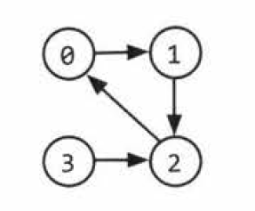

# Graph
> source: https://www.youtube.com/watch?v=gXgEDyodOJU&list=PL2_aWCzGMAwI3W_JlcBbtYTwiQSsOTa6P&index=39&t=0s

- a graph G is an ordered pair of a set V of vertices and a set E of edges
- order matters
- you can have graphs that have both undirected and directed edges (complicated)
- model and represent a variety of systems
- made up of collections of objects/entities we call node/vertices
- acyclic graph is one that's without cycles
- If there's a path between every pair of vertices, it's called a connected graph. 


$G = (V, E)$

* V are essentially nodes. 
* E are edges that are uniquely identified by 2 endpoints and it can be of 2 types:
  - undirected: can go from u -> v and v -> u, order doesn't matter. It's an unordered pair of {u, v} 
  - directed: can only go from u -> v and then v -> u has to be another set, order matters so (u, v), (v, u)

Consider the following graph:


* The vertices are `V = {v1, v2, v3, v4, v5, v6, v7, v8}`

* The edges are undirected so `E = { {v1, v2}, {v1, v3}, {v1, v4}, {v2, v5}, {v2, v6}, {v3, v7}, {v4, v8}, {v7, v8}, {v5, v8}, {v6, v8} }`


## 2 Major types of graphs

1. Directed Graph (Digraph)

1. Undirected Graph - no special name like a digraph

## Real world representations of graphs
- graphs can be used to represent any collection of objects having pairwise relationships

1. Social Network (e.g faceook) - using undirected graphs - if you are my friend i am your friend too


## Comp sci representation of graphs

### Adjacency List
* The most common way to represent a graph
* Each node (vertex) stores a list of adjacent vertices
* in the case of an undirected graph, (a,b) would be stored twice 

```cpp

class Graph {
  private:
    Node nodes[size];
}

class Node {
  private: 
    int data;
    Node children[size];
}

```
* you might also be able to just use an array or a hashtable of tasks to store the ajacency list:

{0: [1]
1: [2]
2: [0,3],
3: [2]}

* but always a good practice to use node classes instead of using this. 


### Adjacency Matrix
- using an NxN boolean matrix to represent an edge between node i to node j. N being the number of nodes
- the same graph algorithms that are used on adjacency lists (bfs) can be performed with ajacency matrices, but they might be somewhat less efficient. In the adjacency list representation, you can easily iterate through the neighbors of a node, but in a matrix representation, you need to iteration through all the nodes to identify the nodes' neighbors. 



| |0|1|2|3|
|-|-|-|-|-|
|0|0|1|0|0|
|1|0|0|1|0|
|2|1|0|0|0|
|3|0|0|1|0|