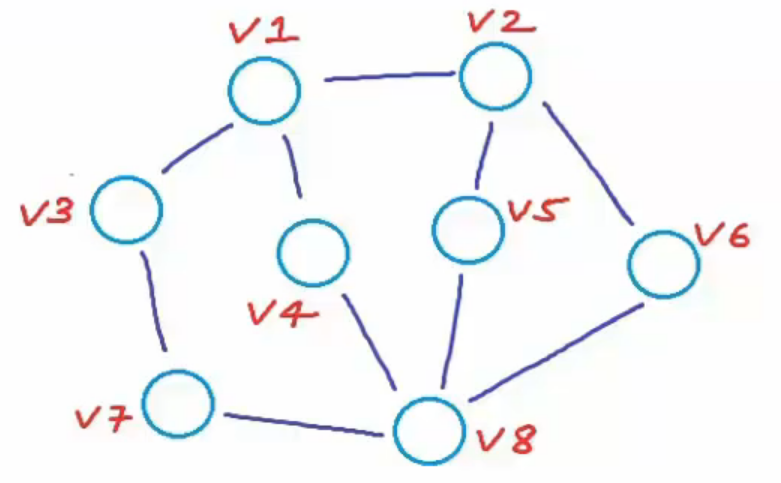

# Graph
> source: https://www.youtube.com/watch?v=gXgEDyodOJU&list=PL2_aWCzGMAwI3W_JlcBbtYTwiQSsOTa6P&index=39&t=0s

- a graph G is an ordered pair of a set V of vertices and a set E of edges
- order matters
- you can have graphs that have both undirected and directed edges (complicated)
- model and represent a variety of systems
- made up of collections of objects/entities we call node/vertices

$G = (V, E)$

* V are essentially nodes. 
* E are edges that are uniquely identified by 2 endpoints and it can be of 2 types:
  - undirected: can go from u -> v and v -> u, order doesn't matter. It's an unordered pair of {u, v} 
  - directed: can only go from u -> v and then v -> u has to be another set, order matters so (u, v), (v, u)

Consider the following graph:

* The vertices are `V = {v1, v2, v3, v4, v5, v6, v7, v8}`

* The edges are undirected so `E = { {v1, v2}, {v1, v3}, {v1, v4}, {v2, v5}, {v2, v6}, {v3, v7}, {v4, v8}, {v7, v8}, {v5, v8}, {v6, v8} }`

## 2 Major types of graphs

1. Directed Graph (Digraph)

1. Undirected Graph - no special name like a digraph

## Real world representations of graphs
- graphs can be used to represent any collection of objects having pairwise relationships

1. Social Network (e.g faceook) - using undirected graphs - if you are my friend i am your friend too
1. 