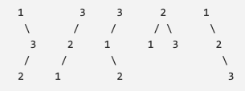

# Binary Search Tree (BST)

- it's an efficient structure to organize data for quick search and quick update
- for each node, the value of all the nodes in the left subtree is lesser than or equal to and value of all the nodes in the right subtree is greater. 

      [8]
  [4]     [10]
[2] [6]       [20]

- to avoid search operation to be O(n), we need to make the tree as balanced as possible (ie. The height difference between left subtree and right subtree is at most 1)
- balanced subtree = search is O(logn), not balanced in worst case is O(n)

Here are some valid BST's (not balanced, some are not balanced, but is still valid bst because nodes in subtrees are either less(left) or greater(right))

## Implementation
- You would usually use a balanced binary tree for the implementation, and if the BST is balanced, then you can use array for the representation.