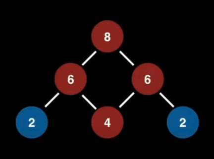
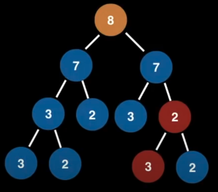
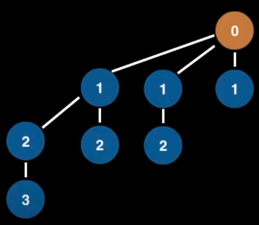
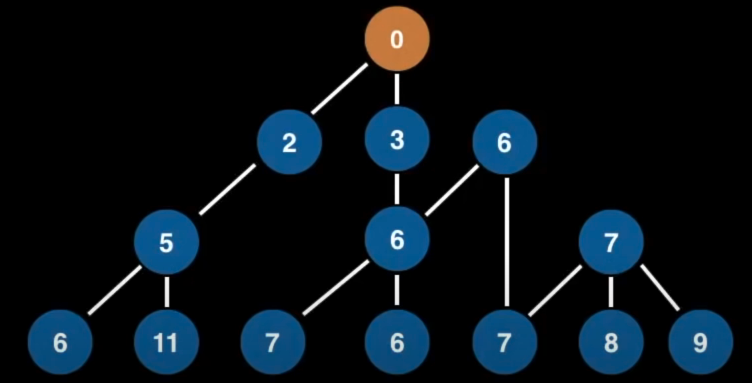
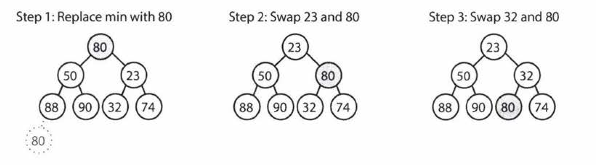
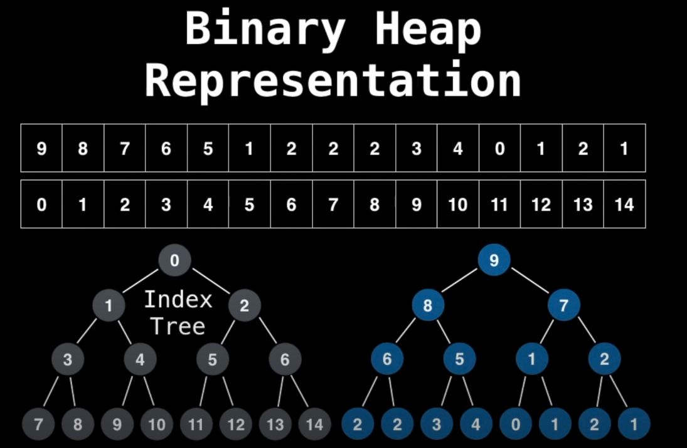

# Heap
- Very much related to priority queues, some say that heaps are used to implement priority queues or that heaps are prirority queues.
- A heap is a **tree-based** Data structure that satisfies the heap property (also known as heap invariant)
- the heap property states: If A is a parent node of B, then A is ordered with respect to B for all nodes A, B in the heap (what this means in plain english is that the value of the parent node is always greater than or equal to all nodes or the other way to around where the parent node is less than or equal )
- heaps in general could have many different number of branches
- heaps are complete binary trees

**Min Heap**
- parent node is always lesser than equal to its children

**Max Heap**
- parent node is always greater than or equal to its children

Examples:
- Even when a tree only has 1 node is also considered a heap

**Invalid Heap** This one isn't a heap because it's not a tree as it contains a cycle

**Invalid Heap** This one is not a heap because it violates the heap invariant property

**Valid** This one is a heap and it's usually seen in binomial heaps

**Valid** This one is a valid heap because it's a tree!

## Implementation
- using arrays

## Types of Heaps

### Min heap
- main operations: extract_min and insert

* `insert`: always insert at the bottom to maintain the complete binary tree property. Then, fix the tree by swapping the new element with its parent, until it finds an appropriate spot for the element; this takes O(log n) - n being the total number of nodes in the heap
* `extract_min`: is easy because the min is always at the top. Once the min is removed, you need to replace the root with something else. You can replace it with the last element on the heap and then bubble it down. You will have to choose the smallest value from either the left or right child to maintain the heap invariant. This takes O(logn)

This image shows the how element bubbling down to a position that will maintain heap property. (Source: CTCI) 

### Fibonacci Heap

**Differences between binomial heaps and binary heaps**
https://stackoverflow.com/questions/6215485/what-is-the-difference-between-binary-heaps-and-binomial-heaps#:~:text=3%20Answers&text=The%20key%20difference%20between%20a,which%20is%20a%20binomial%20tree.

### Binary Heap
- It's a binary tree that supports the heap property
- the property of a binary tree is that every node has exactly 2 children
- complete binary tree property - means that every level is completely filled and all nodes are as far left as possible. Whenever we add a new node, it's always from the very left first with the aim to complete the binary tree. 
- Represent binary heaps using an array:

- implemented using array - because it's really fast 

let i be the parent node index

left children: 2i + 1
right children: 2i + 2

**bubbling**
- this is the act of moving a node from bottom to the top

for example, when we want to add elements to a binary heap, we need to make sure we maintain the heap invariant, so adding 

## Binomial Heap

## Pairing Heap