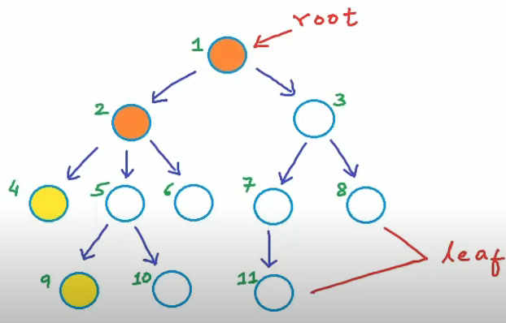

# Tree
> source: https://www.youtube.com/watch?v=qH6yxkw0u78&list=PL2_aWCzGMAwI3W_JlcBbtYTwiQSsOTa6P&index=26&t=0s

- Tree is a non-linear data structure
- it's actually a special kind of graph, but has properties to show when a graph is actually a tree
- it's a collection of nodes linked together to similate a hierarchy
- if a tree has N nodes, then the number of edges it has will always be N - 1. Sometimes the nodes might not have data yet like the nodes at the very end.
- trees can also be referred to as a recrusive data structure

## Terminology

- in the image, the numbers represent names for the nodes, not the data of the node and also doesn't mean that the nodes are sorted in any order. 

- **root** - very first node which is also a parent, the only node without a parent
- **children** 
- **parent**
- **sibling** - nodes must have the same parent
- **leaf** nodes - are nodes that don't have a child
- **ancestors** are nodes that are above current node, so we'll say node 5, 2, and 1 are ancestors of node 9 and 10
- **descendent** are nodes that are childrens of a certain node, so we'll say that 4, 5, 6, 9 and 10 are descendents are node 2.
- **cousins** are nodes that have the same grandparent but different parent
- **subtrees** 

## Depth and Height
- Depth of some node x can be defined as the length of path from x to root
- e.g. in the picture above, the depth of root is zero, depth of node 2 and 3 are 1, depth of nodes 4, 5, 6, 7, 8 are 2...so on and so forth

- Height of some node x can be defined as the number of edges in longest path from x to a leaf. e.g. the height of node 3 is 2 because the longest path to a leave node is the link to 7 then the link to 11, so there's 2 links/edges. Height of leaf node is zero. 

- Height of a tree is the height of the root node
- Height of tree with only 1 node is 0
- Height of an empty tree is -1
- Max Depth of tree is also equal to the height of the tree.
  
## Real World Example
- Document Object Model is a tree structure
- File System in your operating system
- Used for Trie
- Network routing algorithm
- Used also for origanizing data for quick search, insertion, deletion

## Types
* AVL Tree
  * AVL stands for Adelson-Velsky and Landis, and it's a self-balancing binary search tree
* Binary Search Tree
  * This is a Binary Tree but sorted
* Binary Tree
  * Is a tree with at most 2 children
* Fenwick Tree
* Minimum Spanning Trees
* Binary Heap
* Heap 